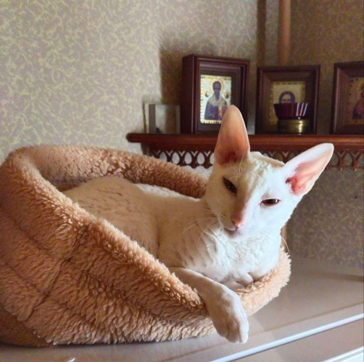

# Страничка святого котэ

### **Здраствуйте, это я, Котофей Котофеевич.**
   
#### Мой обычный распорядок дня : 
  
1. Разбудить паству для почевания утренней трапезы.
2. Помочь пастве песнопением для ускорения приготовления даров божьих.
3. Трапеза.
4. Посещение уборной.
5. Помочь пастве собраться по делам мирским.
6. Проводы паствы песнопением.
7. Пока паствы нет, навести порядок в храме.
8. Сон.
9. Трапеза.
10. Сон.
11. Трапеза.
12. Еще немного порядка.
13. Встреча паствы у ворот храма песнопением.
14. Святые обятия.
15. Трапеза.
16. Наблюдение с паствой за священной живой картиной.
17. Посещение уборной.
18. Сон с паствой.

### И так каждый день.

## __Во имя лотка, корма, и святой когтеточки.__